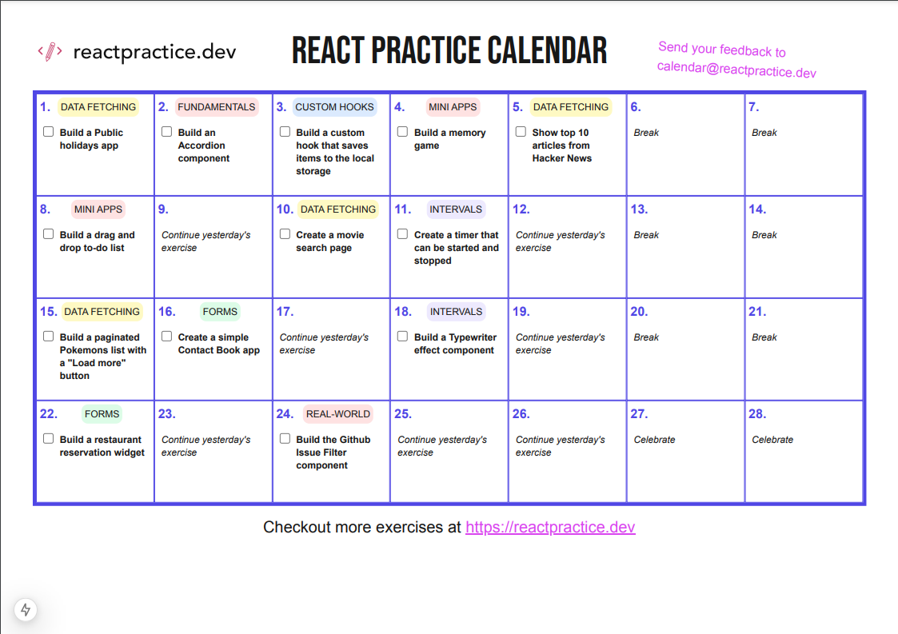

# React Practice Calendar – Free Solutions



Saw this [interesting challenge](https://reactpractice.dev/start-here/) from the folks over at https://reactpractice.dev

This repo contains my free versions of solutions for the challenges on the calendar
[react-practice-calendar.pdf](https://reactpractice.dev/content/files/2024/12/react-practice-calendar.pdf)

## 👀 Preview

[Click here to preview the app deployed on vercel](https://react-practice-calendar.vercel.app/)

## 🚀 Tech Stack

- React (with Hooks)
- Vite 
- Tailwind


## 📂 Getting Started

For an online sandbox environment, [open this repository on stackblitz](https://stackblitz.com/~/github.com/ashvinpanicker/react-practice-calendar)

Alternatively, follow the below steps to run this locally.

**Prerequisite** Node 20+


1. **Clone the repo and install packages**
   ```bash
   git clone https://github.com/ashvinpanicker/react-practice-calendar
   
   cd react-practice-calendar
   
   npm install
   ```
2. Run the development server
    ```bash
    npm run dev
    ```


